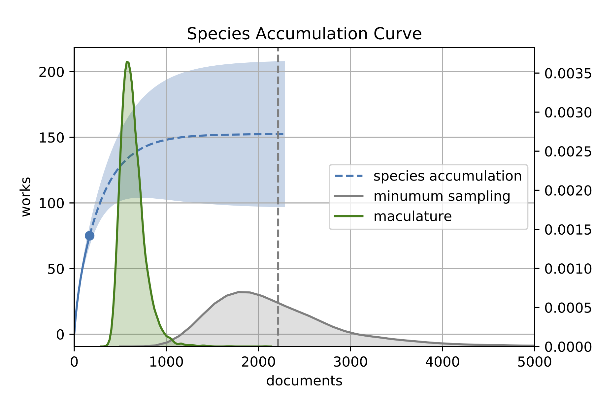

# Estimating the Loss of Medieval Literature with an Unseen Species model from Ecodiversity

This repository accompanies a short paper for the first [Computational Humanities Research Workshop](https://www.computational-humanities-research.org/) (18-20 november 2020; to be held online):

> M. Kestemont & F. Karsdorp, 'Estimating the Loss of Medieval Literature with an Unseen Species model from Ecodiversity'. *Computational Humanities Research Workshop*. Amsterdam [online], 18-20 november 2020.

This repository that contains all the code and software (with some documentation interwoven) necessary to replicate our findings; this (and each future release) will be archived on [Zenodo](https://zenodo.org/). The paper offers a more technical complement to and extension of a Dutch-language journal article that was previously published, but which was targeted at a broader audience of literary historians:

> Kestemont, M. & Karsdorp, F., ‘Het Atlantis van de Middelnederlandse ridderepiek. Een schatting van het tekstverlies met methodes uit de ecodiversiteit’, *Spiegel der Letteren* 61:3 (2019), 271-290.

We ran all the code in an [Anaconda](https://www.anaconda.com/) installation of Python 3.6.10. The top-level directory of this repository has a `requirements.txt` file that you can use to install the more specific version of the third-party packages used here. Note that the data used here feature a number of minor improvements in comparison to that for the SDL paper (with some insignificant fluctuations in the results). The data format is documented in the notebook under `/notebooks`.

__Erratum (22/02/2021)__: In follow-up work, we have discovered that the published version of the paper contains an inaccurate interpretation of the output of the `minsample()` function, as originally defined in this repository. In the terminology of Chao et al. (2009), this function returned *m = n * x^**, and not *n + m*, as we incorrectly claimed in the paper. Because *n <<< m $*, however, the results don't shift much and the main arguments of the paper still stand firmly. This does mean that the document survival estimate has to be adjusted downwards. A more correct estimate for the original number of documents in the population therefore is: 

> Minimum sampling: 2214.77 CI(1231.19 - 4173.42)

Consequently, the correct document survival estimate is rather: 7.54% (~ 167/2215 MSS). The code and graphs in this repository have been corrected in the latest release. (None of the other results reported in the paper are affected by this issue.)
